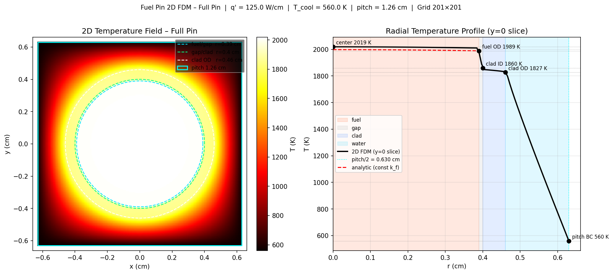
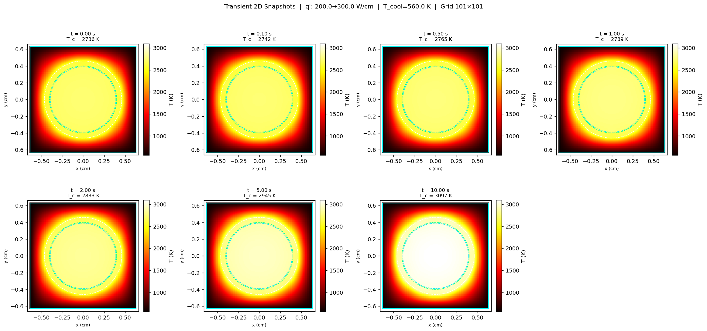
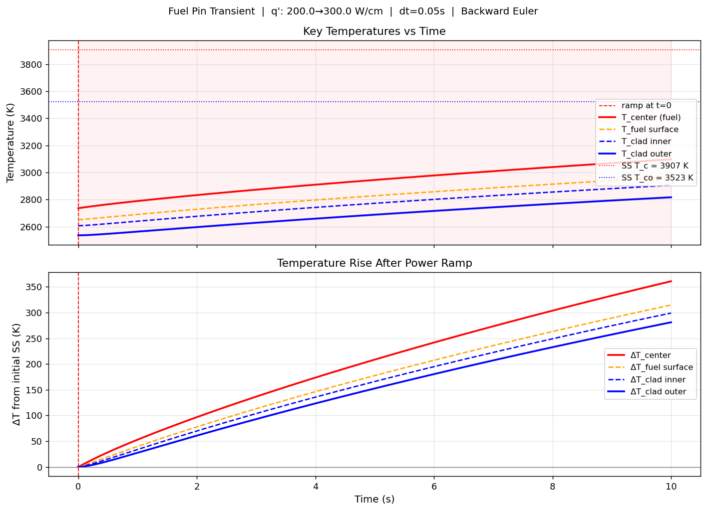
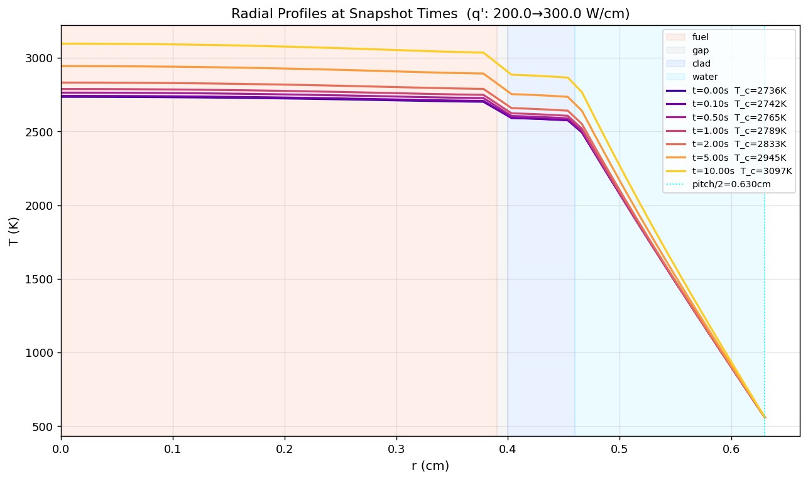
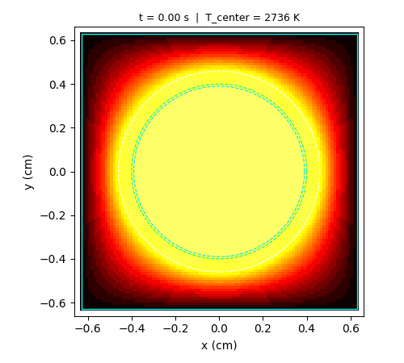

# Fuel Pin 2D FDM Thermal Diffusion Solver (Full Pin)

This project solves the steady-state temperature distribution in a nuclear fuel pin using a 2D Finite Difference Method (FDM) on a Cartesian grid.

## 🔧 Physics Model

Solves:
\[
-\nabla \cdot (k \nabla T) = q'''
\]

### Regions
- **Fuel** (heat generation)
- **Gap** (He gas)
- **Clad** (Zircaloy)
- **Water** (coolant / boundary region)

### Boundary Condition
- Dirichlet: \( T = T_{cool} \) on outer pitch boundary

### Fuel Conductivity
Temperature-dependent:
\[
k(T) = \frac{1}{0.0452 + 2.46\times10^{-4}T + 5.47\times10^9 e^{-16350/T}/T^2}
\]

---

## ⚙️ Numerical Method

- 2D uniform Cartesian grid
- 5-point finite difference stencil
- Harmonic mean conductivity at interfaces
- Newton iteration for non-linear fuel conductivity
- Sparse linear solve (`scipy.sparse.linalg.spsolve`)

---

## 📌 Output

- 2D temperature field heatmap
- Radial temperature profile (fuel → coolant)
- Key temperature points (center, fuel surface, clad, boundary)

Generated file: 
## 📊 Results & Outputs

### 🔥 Steady-State Temperature Field

---

### ⏱️ Transient Temperature Evolution (Snapshots)

---

### 📈 Temperature vs Time

---

### 🔄 Radial Temperature Profile

---

### 🎞️ Transient Animation (GIF)

---

### 🎬 MP4 Animation Output
(output video)

---
